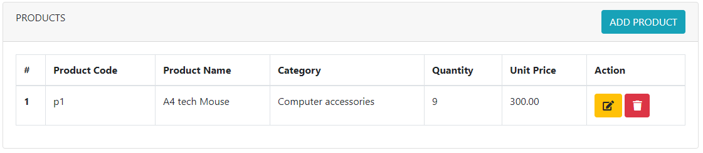
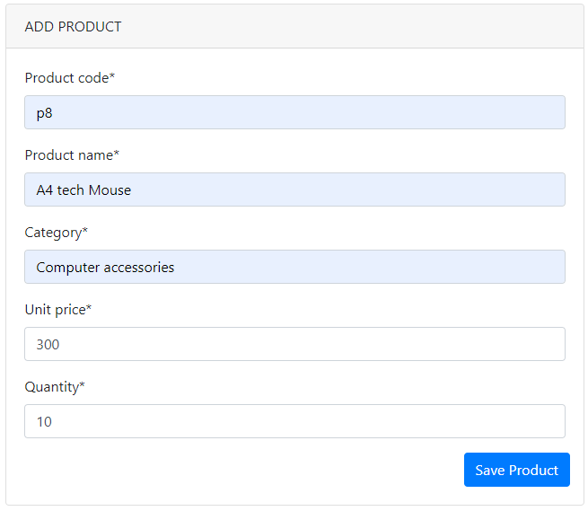
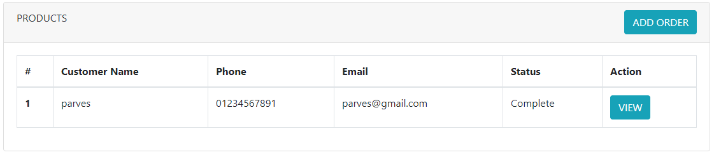
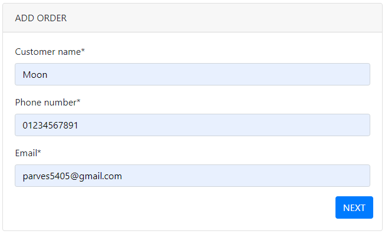
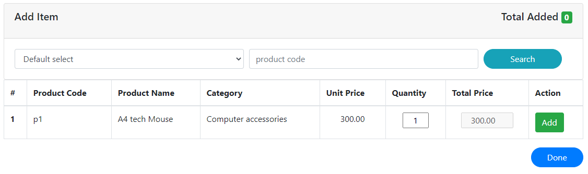
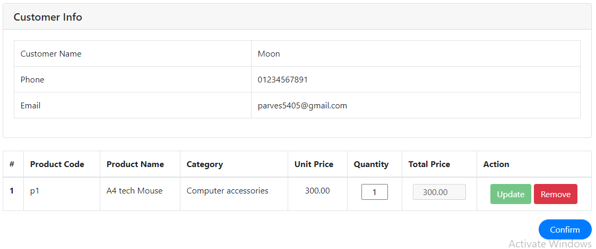
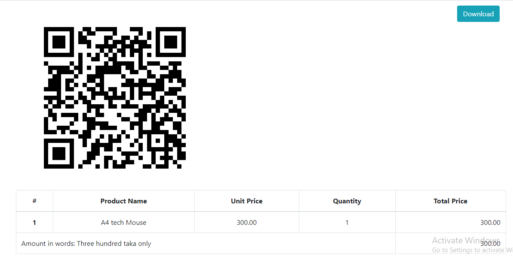

# eShop_management

## Introduction
This is an application of Super Shop Management System which have some basic functionalities as stated below:

### 1. Product Management:
The whole process to manage product is considered here. Product can be created, updated and deleted here.
### 2. Order Management
This is the main part of this project. The process to maintain order, add customer, manage item and lastly generate invoice with qr ocde and the pdf
also taken into consideration here. Item can also search through product_code or by selecting product_name through dropdown. Validation is also done 
if the product is out of stock.

### Below shows a higher level overview of database design

|    Orders     | order_product (AddItem) | products     |
|---------------|-------------------------|--------------|
| order_number  |         order(pk)       | product_code |
|customer_name  |        product(pk)      | product_name |
|phone_number   |        quantity         | category     |
|email          |        total_price      | unit_price   |
|confirm        |                         | quantity     |
|grand_total_price|                       | created_at   |
|created_at    |                          | updated_at   |
|updated_at    |                          |              |
|qr_code       |                          |              |

## Installation (Run the project locally)
1. Download or Clone the project from:
> git clone https://github.com/parves-ahmed/eShop_management.git
2. Go to project root:
> cd djangoProject
3. Create Virtual envvironment and activate it
4. Install all requirements from requirements.txt:
> pip install -r requirements.txt
5. Run the server
> python manage.py runserver
6. Result generates in:
> http://127.0.0.1:8000

## User Manual
You can catch the app live on: https://estore20.herokuapp.com/

### Product Section

> Add Product

Click the live link that will redirect you to Product list page as below: 

Click on  'ADD PRODUCT' button.

Give required data and Click 'Save Product' 

> Update or Delete Product

 

Click on 'Update' icon for update the product. 
To delete product click on 'Delete' icon. (Icon show under 'Action' column). 

### Order Section

Click on Order link on top navigation bar. It'll redirect you to Order list as below:

 

Click on 'ADD ORDER' Button.

> Input Customer Info

 

Input Customer Info and click 'NEXT'.

> Add Item 

You can search item through product_code and product_name. Input quantity, Default is 1. 
If the given quantity is greater than stock it'll warn you.  

Clcik 'Add' to add item.

When you are done clcik 'Done' button.

> Confirm Order

It'll redirect you to: 

It'll show all listed item that you added. You can update or delete item. 
'Update' button is disabled by default. If you changed the quantity it'll enabl then.

To update, click on 'Update' button. To remove click 'Remove'

If all is ok then click 'Confirm'.

> Invoice

Now, you can see the invoice with QR code. If you scan the QR code, you can see customer info for this order you added.

You can download the pdf. To download it, click on 'Download' button on right-top corner.
